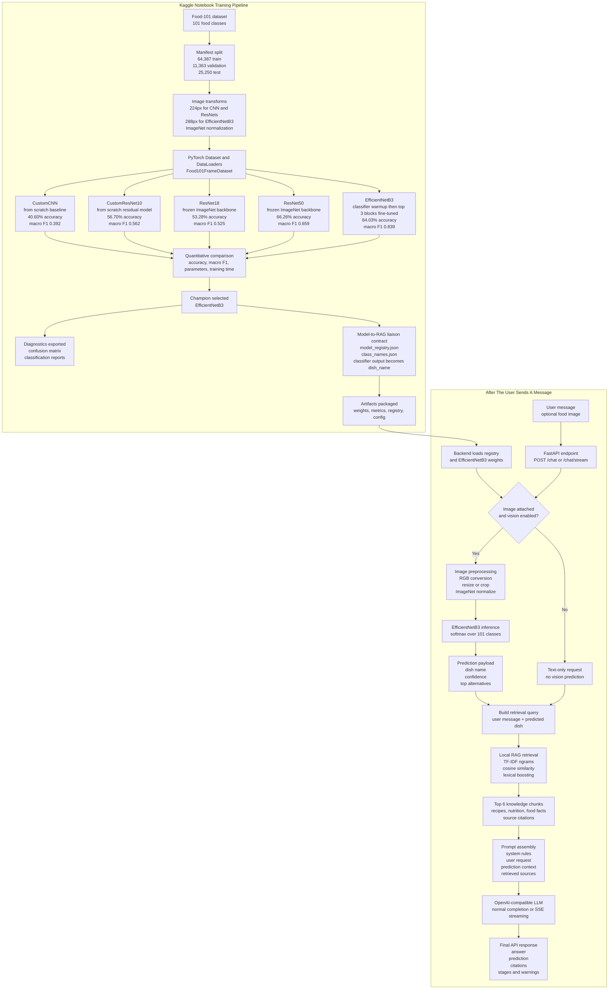

# Foody

**A Food-101 image recognition and recipe RAG chat assistant powered by PyTorch and OpenAI-compatible LLMs.**

`101 food classes` · `5 trained models` · `84% top accuracy` · `RAG-augmented chat` · `60+ themes`

---

## What is Foody?

Foody is an end-to-end deep learning project that combines **computer vision** with **Retrieval-Augmented Generation (RAG)** to create an intelligent food assistant.

**How it works:**
1. You upload a food photo
2. A PyTorch classifier identifies the dish from 101 categories
3. A RAG pipeline retrieves relevant recipes, nutrition data, and food knowledge
4. An LLM generates a detailed, context-grounded response

No prior deep learning knowledge is needed to use it — just upload a photo and chat.

---

## Models Trained

Five deep learning models were trained on the [Food-101 dataset](https://data.vision.ee.ethz.ch/cvl/datasets_extra/food-101/) (101,000 images across 101 food categories) using a Kaggle notebook on NVIDIA Tesla T4 GPUs.

| Model | Type | Input Size | Test Accuracy | Macro F1 | Parameters | Training Time |
|-------|------|:---:|:---:|:---:|:---:|:---:|
| **EfficientNetB3** ★ | Transfer Learning | 288px | **84.03%** | 0.839 | 8.66M | 4h 1m |
| ResNet50 | Transfer Learning | 224px | 66.26% | 0.659 | 207K | 1h 20m |
| CustomResNet10 | From Scratch | 224px | 56.70% | 0.562 | 4.96M | 1h 0m |
| ResNet18 | Transfer Learning | 224px | 53.28% | 0.525 | 52K | 1h 6m |
| CustomCNN | From Scratch | 224px | 40.60% | 0.392 | 1.19M | 1h 1m |

**EfficientNetB3** is the champion model, trained in two phases:
- **Phase 1** (4 epochs): Freeze backbone, train only the classifier head
- **Phase 2** (12 epochs): Unfreeze top 3 blocks and fine-tune with a lower learning rate

All models use ImageNet normalization (`mean=[0.485, 0.456, 0.406]`, `std=[0.229, 0.224, 0.225]`).

### What each model is

| Model | Explanation |
|-------|-------------|
| **CustomCNN** | A basic convolutional neural network built from scratch — serves as the simplest baseline |
| **CustomResNet10** | A custom network with "skip connections" (residual blocks) built from scratch — tests if skip connections help |
| **ResNet18** | A pre-trained model (trained on ImageNet) with its learned features frozen — only the final classification layer is retrained for food |
| **ResNet50** | A deeper version of ResNet18 with more layers — tests if depth improves accuracy |
| **EfficientNetB3** | A state-of-the-art architecture that scales width, depth, and resolution efficiently — our best performer |

---

## Training Pipeline

The full training pipeline lives in a single Kaggle notebook (`notebooks/main/`) with 93 cells organized into 13 stages:

| Stage | What Happens |
|:---:|---|
| 1 | **Setup & Configuration** — Import libraries, set hyperparameters, configure CUDA and random seed (42) |
| 2 | **Dataset Acquisition** — Locate or download the Food-101 dataset |
| 3 | **Manifest & Splitting** — Split into 64,387 train / 11,363 val / 25,250 test images (stratified 85/15) |
| 4 | **Visual EDA** — Verify class balance, preview sample images from each category |
| 5 | **Data Transforms** — ImageNet normalization + augmentation at 224px and 288px |
| 6 | **Datasets & DataLoaders** — Custom PyTorch Dataset class, multi-worker data loading |
| 7 | **Model Architectures** — Define all 5 model architectures |
| 8 | **Training Loop** — Unified training loop with AMP mixed precision, early stopping (patience=4), epoch checkpoints |
| 9 | **Training Execution** — Train all 5 models sequentially |
| 10 | **Quantitative Comparison** — Side-by-side accuracy bar chart and metrics table |
| 11 | **Qualitative Diagnostics** — Confusion matrix heatmap and per-class classification report |
| 12 | **Inference & Contract** — Single-image prediction function, export `model_registry.json` |
| 13 | **Packaging & Export** — Save `training_config.json`, zip all artifacts for backend deployment |

---

## RAG Pipeline

Foody uses **Retrieval-Augmented Generation** to ground LLM responses in real food knowledge instead of hallucinating.

**Knowledge sources:**
- `knowledge/food101_recipes.md` — Recipe profiles for all 101 food categories
- `knowledge/nutrition_calorie_guide.md` — General nutrition and calorie guidance
- Nutrition5k metadata CSVs — Real measured nutrition data from 5,000+ cafe dishes

**How retrieval works:**
1. User message + predicted dish name → combined query
2. TF-IDF vectorizer (1,2-grams, 12,000 features) computes document embeddings
3. Cosine similarity + lexical boosting ranks knowledge chunks
4. Top 6 chunks are injected into the LLM prompt as grounding context
5. The LLM generates a response backed by retrieved sources

**RAG citations** are displayed in the chat UI so users can verify the sources.

---

## How It All Works - Training to Chat

This UML-style flow is based on `notebooks/main/notebook7d111d6ae9.html`: it shows what was trained, which model won, how the model-to-RAG liaison was exported, and what happens after a user sends a message.



**Reading the diagram:**
- The notebook trained and compared all five models, not just the final app model.
- EfficientNetB3 won the comparison and became the backend recognition model.
- The liaison between vision and RAG is the exported contract: the classifier produces a `dish_name`, and that dish name is combined with the user message for retrieval.
- After `/chat` or `/chat/stream`, the backend runs recognition when an image exists, retrieves the top knowledge chunks, builds the prompt, and returns the LLM answer with citations.

## How to Run

### Prerequisites
- Python 3.11+
- Node.js 18+
- PyTorch model weights in `models/` (exported from the training notebook)

### Backend
```bash
cd backend
pip install -r requirements.txt
python -m foody.cli serve --host 127.0.0.1 --port 8000
```

### Frontend
```bash
cd frontend
npm install
npm run dev
```

Then open **http://localhost:3000**

### Quick Predict (CLI)
```bash
python -m foody.cli predict path/to/food-image.jpg
```

### Run Both (PowerShell)
```powershell
.\run_dev.ps1
```

---

## API Endpoints

| Method | Path | Description |
|--------|------|-------------|
| `GET` | `/health` | Health check |
| `GET` | `/metadata` | Available models, RAG chunk count, pipeline info |
| `GET` | `/notebook` | Training notebook JSON (for in-app viewer) |
| `POST` | `/predict` | Image → Food-101 classification result |
| `POST` | `/chat` | Image + text → RAG-augmented response |
| `POST` | `/chat/stream` | SSE streaming version of `/chat` |
| `POST` | `/llm/models` | Fetch available models from an OpenAI-compatible endpoint |

---

## Project Structure

```
foody/
├── backend/
│   ├── foody/
│   │   ├── __init__.py
│   │   ├── core/
│   │   │   └── config.py              # Central configuration (paths, LLM settings)
│   │   ├── routes/
│   │   │   └── main.py                # FastAPI endpoints
│   │   ├── services/
│   │   │   ├── assistant.py           # Orchestrates recognition + RAG + LLM
│   │   │   ├── recognition.py         # Food-101 PyTorch classifier loader
│   │   │   ├── rag.py                 # TF-IDF RAG retrieval index
│   │   │   ├── llm.py                 # OpenAI-compatible streaming chat client
│   │   │   └── foody_rules.md         # LLM system prompt rules
│   │   └── cli/
│   │       └── cli.py                 # CLI: predict, serve
│   └── requirements.txt
├── frontend/
│   ├── app/                           # Next.js pages + layout
│   ├── components/
│   │   ├── chat/                      # Chat input, messages, model selector
│   │   ├── foody/                     # Animations (matrix, scramble, shimmer)
│   │   ├── layout/                    # Topbar, sidebar
│   │   ├── notebook/                  # Training notebook viewer
│   │   ├── settings/                  # Settings dialog (themes, models, RAG)
│   │   └── ui/                        # Base UI components (button, textarea)
│   ├── lib/
│   │   ├── api.ts                     # Backend API client
│   │   ├── types.ts                   # TypeScript type definitions
│   │   ├── notebook-parser.ts         # Notebook .ipynb parser
│   │   └── utils.ts                   # Utility functions
│   └── package.json
├── models/                            # PyTorch weights + metadata JSONs
│   ├── EfficientNetB3_best.pth        # Champion model (84.03% accuracy)
│   ├── CustomCNN_best.pth
│   ├── CustomResNet10_best.pth
│   ├── ResNet18_best.pth
│   ├── ResNet50_best.pth
│   ├── class_names.json               # 101 Food-101 class names
│   ├── model_registry.json            # Model metadata for backend
│   └── training_config.json           # Training hyperparameters
├── knowledge/                         # RAG knowledge base
│   ├── food101_recipes.md             # 101 recipe profiles
│   └── nutrition_calorie_guide.md     # Nutrition guidance
├── notebooks/
│   └── main/                          # Kaggle training notebook (93 cells)
├── results/                           # Training metrics + history
│   ├── model_comparison.csv
│   ├── EfficientNetB3_history.csv
│   └── EfficientNetB3_metrics.json
└── run_dev.ps1                        # Dev launcher script
```

---

## Tech Stack

| Layer | Technology |
|-------|-----------|
| **Frontend** | Next.js 14, React 18, TailwindCSS, TypeScript |
| **Backend** | Python 3.11, FastAPI, Uvicorn |
| **Vision** | PyTorch, torchvision (EfficientNetB3, ResNet, custom CNNs) |
| **RAG** | scikit-learn TF-IDF, cosine similarity, pandas |
| **LLM** | OpenAI-compatible API (GPT-4o-mini default, configurable) |
| **Training** | Kaggle (NVIDIA Tesla T4), mixed precision (AMP) |
| **Dataset** | Food-101 (101 classes, 101,000 images) |

---

## Features

- **5 trained deep learning models** — compare architectures from scratch CNNs to transfer learning
- **Real-time streaming chat** — token-by-token response display with SSE
- **Drag & drop image upload** — paste from clipboard or drag food photos
- **Vision confidence display** — conic gradient ring showing prediction confidence with top-k alternatives
- **RAG citation panel** — expandable source references for every response
- **60+ UI themes** — dark, light, and colorful themes (Matcha, Sakura, Cyberpunk, etc.)
- **In-app notebook viewer** — browse the full training pipeline without leaving the app
- **Conversation history** — persisted in browser localStorage
- **Text-to-speech** — read responses aloud
- **Configurable LLM providers** — use OpenAI, local models, or any compatible endpoint
